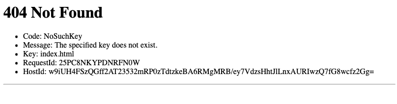

# Set up S3

## Objectives

Learn:
- To use a fundamental AWS service: S3
- How to host a static website on AWS

## Task: Create an S3 bucket

S3 stands for Simple Storage Service. It provides something called Object
Storage. This means it stores files (objects) as a collection of items in an
area that is, on AWS, called a 'bucket'.

Create an [S3 Bucket](https://aws.amazon.com/s3/) and configure it to host a
static website.

## Key steps

You will need to do three key things:

* Create the bucket.
* Enable static website hosting.
* Configure the permissions to allow public access.  
  This will involve adjusting both the 'Block public access' and 'Bucket policy'
  sections.

This will involve some research. Cloud documentation takes some careful reading,
but if you want to be a professional cloud engineer there is no way around
reading documentation — so while we will steer you, you'll need to do the
research yourself too.

## Check your work

You'll know you've done this right when:

1. You can go to Amazon S3.
2. You can see your bucket name.
3. You can click it and see the details.
4. You can click the 'Properties' tab.
5. Right at the bottom, you can see something like this:

   

6. When you click the link to your bucket website endpoint, you should see
   something like this:

   

   This _must_ be a 404 error, or if you uploaded something to test it then you
   should see that. **If you see a 403 error you are not done!**

When you're done, you can create a file `index.html` with the below contents and
upload it to the bucket to see it live:

```html
<html lang="en">
  <head>
    <title>It works!</title>
  </head>
  <body>
    <h1>It works!</h1>
  </body>
</html>
```


[Next Challenge](02_set_up_jenkins.md)

<!-- BEGIN GENERATED SECTION DO NOT EDIT -->

---

**How was this resource?**  
[😫](https://airtable.com/shrUJ3t7KLMqVRFKR?prefill_Repository=makersacademy%2Fserverless-cicd&prefill_File=01_set_up_s3.md&prefill_Sentiment=😫) [😕](https://airtable.com/shrUJ3t7KLMqVRFKR?prefill_Repository=makersacademy%2Fserverless-cicd&prefill_File=01_set_up_s3.md&prefill_Sentiment=😕) [😐](https://airtable.com/shrUJ3t7KLMqVRFKR?prefill_Repository=makersacademy%2Fserverless-cicd&prefill_File=01_set_up_s3.md&prefill_Sentiment=😐) [🙂](https://airtable.com/shrUJ3t7KLMqVRFKR?prefill_Repository=makersacademy%2Fserverless-cicd&prefill_File=01_set_up_s3.md&prefill_Sentiment=🙂) [😀](https://airtable.com/shrUJ3t7KLMqVRFKR?prefill_Repository=makersacademy%2Fserverless-cicd&prefill_File=01_set_up_s3.md&prefill_Sentiment=😀)  
Click an emoji to tell us.

<!-- END GENERATED SECTION DO NOT EDIT -->
