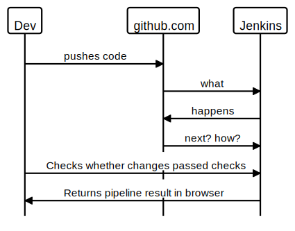

# Bonus tasks: Deepen your understanding, consolidate and explore

Here are some pathways you might choose depending on what you want to learn next, how much challenge you want to take on, and how much structure or freedom you would like. Go back to this week's learning objectives or ask a coach if you'd like some advice with choosing one.

Feel free to tackle them in any order you like — you almost certainly won't complete them all.

- **[Monitoring and debugging Lambda functions](#monitoring-and-debugging-lambda-functions)**  
  To learn how to get visibility in a Serverless environment.
- **[Deploy the Lambda function automatically](#deploy-the-lambda-function-automatically)**  
  To learn more about using the AWS CLI and working with Jenkins pipelines.
- **[Use separate pipelines for testing and deployment](#use-separate-pipelines-for-testing-and-deployment)**  
  To develop your understanding of CI-CD best practices and learn how to make separate Jenkins pipelines depend on each other.
- **[Feature testing](#feature-testing)**  
  To develop you understanding of the advantages and disadvantages of a Serverless architecture and practise building a more complex CI-CD pipelines.
- **[Improve your understanding of how DevOps tools work together](#improve-your-understanding-of-how-devops-tools-work-together)**    
  A diagramming activity to help you explore the inner workings of the system you've been building.
  

## Monitoring and debugging Lambda functions

Find out how to monitor and view logs for your Serverless backend in [AWS CloudWatch](https://aws.amazon.com/cloudwatch/).

You may want to deliberately add some logging to the Lambda function code or introduce bugs that will cause the code to throw errors - are you able to find evidence of that in the logs?

## Deploy the Lambda function automatically

Find a way to automatically deploy changes to the Lambda function code instead of manually pasting them into the AWS Console. 

## Use separate pipelines for testing and deployment

At the moment, the CI-CD pipeline immediately deploys whenever tests pass.
This might not always be appropriate or safe for all projects (why not?).

Find a way to *decouple* testing from deployment by using two different `Jenkinsfile`s rather than one.

## Feature testing

At the moment, the website has no feature tests that make sure that the backend and frontend work well together.
Research and build a way to automatically run feature tests against your Serverless app before deploying it to production.

## Improve your understanding of how DevOps tools work together

You've set up a connection between Jenkins running on the EC2 instance and your GitHub repository.
But how does it work?

- Via what mechanism does Jenkins find out there was a change to your GitHub repo? 
- How does Jenkins retrieve a copy of the code in the repository? 

 Drawing a [sequence diagram](https://playground.diagram.codes/d/sequence) is a good tool for investigating this. Here's an example to help you get started:

Try to be as detailed and specific as possible in your descriptions of each step.
Share your diagram with a coach to get feedback.

  
<b>Stuck?</b> Click here for some hints.

  :bulb: The documentation for the Jenkins Git Plugin as well as reading the Jenkins logs and GitHub Webhook logs will help you figure out what happens behind the scenes when you do a push. 

## Done?

In this project, you've discovered how to use some of the fundamental building blocks of AWS: EC2 instances and S3 buckets.
You're likely to see these two AWS services crop up in many a project, both in the course and in your future workplace.

You've also learned to use and configure Jenkins, a very popular and powerful automation tool.
You've used it to build your own continuous integration and deployment pipeline, an integral part of any modern software development process.

Finally, you discovered how to use AWS Lambda to quickly spin up a backend for an app *without* having to set up or pay for any long-running servers.
Many companies have embraced Serverless for this reason.

Well done - hopefully, you enjoyed it!